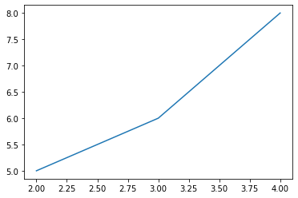

# Project name here
> Summary description here.


This file will become your README and also the index of your documentation.

## Install

`pip install hello_nbdev`

## How to use

Fill me in please! Don't forget code examples:

```python
plot_x_y([2,3,4],[5,6,8])
```




